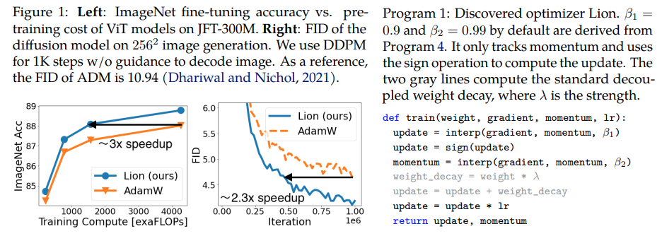

</img>

## 🦁 Lion - Pytorch

<a href="https://arxiv.org/abs/2302.06675">🦁 Lion</a>, Evo**L**ved S**i**gn M**o**me**n**tum, new optimizer discovered by Google Brain that is purportedly better than Adam(w), in Pytorch. This is nearly a straight copy from <a href="https://github.com/google/automl/blob/master/lion/lion_pytorch.py">here</a>, with few minor modifications.

It is so simple, we may as well get it accessible and used asap by everyone to train some great models, if it really works 🤞

### Instructions
- Learning rate and weight decay: the authors write in Section 5 - `Based on our experience, a suitable learning rate for Lion is typically 3-10x smaller than that for AdamW. Since the effective weight decay is lr * λ, the value of decoupled weight decay λ used for Lion is 3-10x larger than that for AdamW in order to maintain a similar strength.` The initial value, peak value, and end value in the learning rate schedule should be changed ***simultaneously*** with the same ratio compared to AdamW, [evidenced by a researcher](https://github.com/lucidrains/lion-pytorch/discussions/1#discussioncomment-5239900).

- Learning rate schedule: the authors use the same learning rate schedule for Lion as AdamW in the paper. Nevertheless, they observe a larger gain when using a cosine decay schedule to train ViT, compared to a reciprocal square-root schedule.

- β1 and β2: the authors write in Section 5 - `The default values for β1 and β2 in AdamW are set as 0.9 and 0.999, respectively, with an ε of 1e−8, while in Lion, the default values for β1 and β2 are discovered through the program search process and set as 0.9 and 0.99, respectively.` Similar to how people reduce β2 to 0.99 or smaller and increase ε to 1e-6 in AdamW to improve stability, using `β1=0.95, β2=0.98` in Lion can also be helpful in mitigating instability during training, suggested by the authors. This was <a href="https://github.com/lucidrains/lion-pytorch/issues/13#issuecomment-1455123143">corroborated by a researcher</a>.

### Updates
- Update: seems to work for my local enwik8 autoregressive language modeling.

- Update 2: <a href="https://api.wandb.ai/links/lucidrains/d4v6c8sl">experiments</a>, seems much worse than Adam if learning rate held constant.

- Update 3: Dividing the learning rate by 3, seeing better early results than Adam. Maybe Adam has been dethroned, after nearly a decade.

- Update 4: using the 10x smaller learning rate rule of thumb from the paper resulted in the worst run. So I guess it still takes a bit of tuning.

A summarization of previous updates: as shown in the <a href="https://api.wandb.ai/links/lucidrains/d4v6c8sl">experiments</a>, Lion with a 3x smaller learning rate beats Adam. It still takes a bit of tuning as a 10x smaller learning rate leads to a worse result.

- Update 5: so far hearing all positive results for language modeling, when done right. Also heard positive results for significant text-to-image training, although it takes a bit of tuning. The negative results seem to be with problems and architectures outside of what was evaluated in the paper - RL, feedforward networks, weird hybrid architectures with LSTMs + convolutions etc. Negative anecdata also confirms this technique is sensitive to batch size, amount of data / augmentation. Tbd what optimal learning rate schedule is, and whether cooldown affects results. Also interestingly have a positive result at open-clip, which became negative as the model size was scaled up (but may be resolvable).

- Update 6: open clip issue [resolved by the author](https://github.com/mlfoundations/open_clip/pull/432#issuecomment-1457323237), by setting a higher initial temperature.

- Update 7: would only recommend this optimizer in the setting of high batch sizes (64 or above)

## Install

```bash
$ pip install lion-pytorch
```

## Usage

```python
# toy model

import torch
from torch import nn

model = nn.Linear(10, 1)

# import Lion and instantiate with parameters

from lion_pytorch import Lion

opt = Lion(model.parameters(), lr=1e-4, weight_decay=1e-2)

# forward and backwards

loss = model(torch.randn(10))
loss.backward()

# optimizer step

opt.step()
opt.zero_grad()
```

To use a fused kernel for updating the parameters, first `pip install triton -U --pre`, then

```python
opt = Lion(
    model.parameters(),
    lr=1e-4,
    weight_decay=1e-2,
    use_triton=True # set this to True to use cuda kernel w/ Triton lang (Tillet et al)
)
```

## Appreciation

- <a href="https://stability.ai/">Stability.ai</a> for the generous sponsorship to work and open source cutting edge artificial intelligence research

## Citations

```bibtex
@misc{https://doi.org/10.48550/arxiv.2302.06675,
    url     = {https://arxiv.org/abs/2302.06675},
    author  = {Chen, Xiangning and Liang, Chen and Huang, Da and Real, Esteban and Wang, Kaiyuan and Liu, Yao and Pham, Hieu and Dong, Xuanyi and Luong, Thang and Hsieh, Cho-Jui and Lu, Yifeng and Le, Quoc V.},
    title   = {Symbolic Discovery of Optimization Algorithms},
    publisher = {arXiv},
    year = {2023}
}
```

```bibtex
@article{Tillet2019TritonAI,
    title   = {Triton: an intermediate language and compiler for tiled neural network computations},
    author  = {Philippe Tillet and H. Kung and D. Cox},
    journal = {Proceedings of the 3rd ACM SIGPLAN International Workshop on Machine Learning and Programming Languages},
    year    = {2019}
}
```

```bibtex
@misc{Schaipp2024,
    author  = {Fabian Schaipp},
    url     = {https://fabian-sp.github.io/posts/2024/02/decoupling/}
}
```
